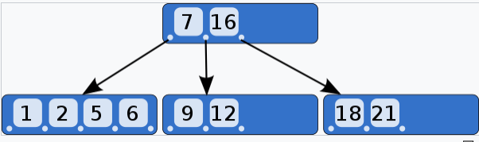
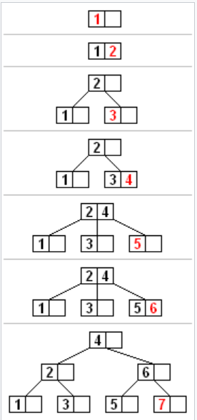

树的层高，有哪些影响？
1. 对比次数，有多高，需要比多少次。在内存中寻址速度可以忽略不计，但对于磁盘搜索，取址操作很耗时，因此需要一种降层高的数据结构，即多叉树。

# B树
概括来说是一个一般化的二叉搜索树（binary search tree）一个节点可以拥有2个以上的子节点。B树适用于读写相对大的数据块的存储系统，例如磁盘。

B树中每一个内部节点会包含一定数量的键，键将节点的子树分开。例如，如果一个内部节点有3个子节点（子树），那么它就必须有两个键： a1 和 a2 。左边子树的所有值都必须小于 a1 ，中间子树的所有值都必须在 a1 和a2 之间，右边子树的所有值都必须大于 a2 。

# B树的性质
对于一棵M阶的B树T，满足以下条件
1. 每个结点至多拥有M棵字数
2. 根结点至少拥有两棵子树
3. 除了根结点外，其余每个分支结点至少拥有M/2棵子树
4. 所有的叶结点都在同一层上
5. 有k棵子树的分支结点则存在k-1个关键字，关键字按照递增顺序进行排序
6. 关键字数量满足ceil(M/2)-1 <=n <= M-1

btree: 所有结点存储数据
b+tree:叶子结点存储数据，内结点只做索引用。mongodb、mysql中磁盘索引用的都是b+tree。
内结点就是非叶子结点（有子结点）

# B-树添加结点
1. 如果节点拥有的元素数量小于最大值，那么有空间容纳新的元素。将新元素插入到这一节点，且保持节点中元素有序。
2. 否则的话这一节点已经满了，将它平均地分裂成两个节点：
    1. 从该节点的原有元素和新的元素中选择出中位数
    2. 小于这一中位数的元素放入左边节点，大于这一中位数的元素放入右边节点，中位数作为分隔值。
    3. 分隔值被插入到父节点中，这可能会造成父节点分裂，分裂父节点时可能又会使它的父节点分裂，以此类推。如果没有父节点（这一节点是根节点），就创建一个新的根节点（增加了树的高度）。

分裂，在添加才有的操作

    根结点分裂，一个变3个，中间根结点变为父节点

# B-树搜索
从根节点开始，从上往下递归的遍历树。在每一层节点上，使用二分查找法匹配目标键，或者通过键的范围来确定子树。

# B-树删除策略
有两种常用的删除策略

1. 定位并删除元素，然后调整树使它满足约束条件； 或者
2. 从上到下处理这棵树，在进入一个节点之前，调整树使得之后一旦遇到了要删除的键，它可以被直接删除而不需要再进行调整
   
删除一个元素时有以下两种特殊情况

1. 这个元素用于分隔一个内部节点的子节点
2. 删除元素会导致它所在的节点的元素或子节点数量小于最低值

## 删除叶子节点中的元素
1. 搜索要删除的元素
2. 如果它在叶子节点，将它从中删除
3. 如果发生了下溢出，按照后面 “删除后重新平衡”部分的描述重新调整树

## 删除内部节点中的元素
内部节点中的每一个元素都作为分隔两颗子树的分隔值，因此我们需要重新划分。值得注意的是左子树中最大的元素仍然小于分隔值。同样的，右子树中最小的元素仍然大于分隔值。这两个元素都在叶子节点中，并且任何一个都可以作为两颗子树的新分隔值。算法的描述如下：

1. 选择一个新的分隔符（左子树中最大的元素或右子树中最小的元素），将它从叶子节点中移除，替换掉被删除的元素作为新的分隔值。
2. 前一步删除了一个叶子节点中的元素。如果这个叶子节点拥有的元素数量小于最低要求，那么从这一叶子节点开始重新进行平衡。

## 删除后的重新平衡
重新平衡从叶子节点开始向根节点进行，直到树重新平衡。如果删除节点中的一个元素使该节点的元素数量低于最小值，那么一些元素必须被重新分配。通常，移动一个元素数量大于最小值的兄弟节点中的元素。如果兄弟节点都没有多余的元素，那么缺少元素的节点就必须要和他的兄弟节点 合并。合并可能导致父节点失去了分隔值，所以父节点可能缺少元素并需要重新平衡。合并和重新平衡可能一直进行到根节点，根节点变成惟一缺少元素的节点。重新平衡树的算法如下：

- 如果缺少元素节点的右兄弟存在且拥有多余的元素，那么向左旋转
  1. 将父节点的分隔值复制到缺少元素节点的最后（分隔值被移下来；缺少元素的节点现在有最小数量的元素）
  2. 将父节点的分隔值替换为右兄弟的第一个元素（右兄弟失去了一个节点但仍然拥有最小数量的元素）
  3. 树又重新平衡

- 否则，如果缺少元素节点的左兄弟存在且拥有多余的元素，那么向右旋转
    1. 将父节点的分隔值复制到缺少元素节点的第一个节点（分隔值被移下来；缺少元素的节点现在有最小数量的元素）
    2. 将父节点的分隔值替换为左兄弟的最后一个元素（左兄弟失去了一个节点但仍然拥有最小数量的元素）
    3. 树又重新平衡
- 否则，如果它的两个直接兄弟节点都只有最小数量的元素，那么将它与一个直接兄弟节点以及父节点中它们的分隔值合并
    1. 将分隔值复制到左边的节点（左边的节点可以是缺少元素的节点或者拥有最小数量元素的兄弟节点）
    2. 将右边节点中所有的元素移动到左边节点（左边节点现在拥有最大数量的元素，右边节点为空）
    3. 将父节点中的分隔值和空的右子树移除（父节点失去了一个元素）
        - 如果父节点是根节点并且没有元素了，那么释放它并且让合并之后的节点成为新的根节点（树的深度减小）
        - 否则，如果父节点的元素数量小于最小值，重新平衡父节点
