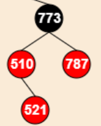
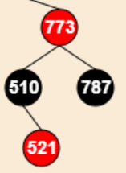
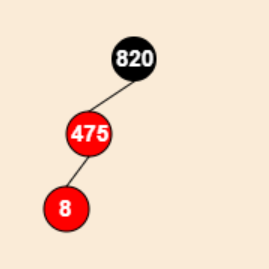
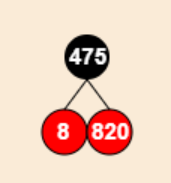
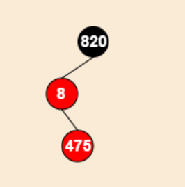
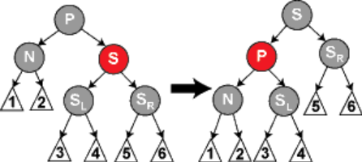
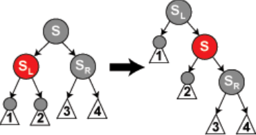
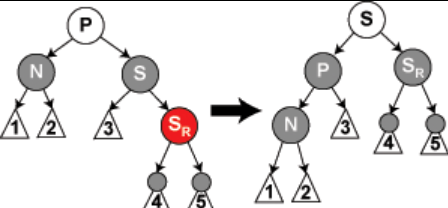

# 红黑树的性质
1. 每个节点非红即黑
2. 根节点是黑的
3. 叶子节点是黑的
4. 如果某个节点是红的，其两个子节点一定是黑的
5. 任意一个节点，从该节点到其子孙节点的所有路径上中黑节点个数是相同的
   
# 红黑树的应用
1. Linux进程调度CFS
2. Nginx Timer事件管理
3. Epoll事件块的管理

# 红黑树添加节点
首先，插入的节点默认是红色节点

其次，插入时存在以下五种情况：
1. 插入节点是红黑树的根节点：
   
   直接把插入节点颜色改为黑色即可。

2. 添加节点的父节点是黑色：
   
   不需要调整。

3. 添加节点的父节点是红色，且叔节点也是红色：

     ---------->
   
   
   则将父、叔节点染成黑色，再将祖父节点染成红色。再将祖父节点向上递归调整。

4. 添加节点的父节点是是祖父节点的左孩子,且是红色，叔节点是叶子节点(不可能为黑色节点，否则不平衡)：
   
   1. 当前插入节点是父节点的左孩子：

           =========> 
   
      先互换祖父节点和父节点的颜色，并对祖父节点进行右旋。

   2. 当前插入节点是父节点的右孩子：
   
      ====>

      先对父节点进行左旋，得到4.1情况，再进行处理。

5. 添加节点的父节点是是祖父节点的右孩子,且是红色，叔节点是黑色：
   
      与情况四原理相同。

# 红黑树删除节点

1. 该节点没有孩子节点
   
   直接删除

2. 该节点有左子树或右子树

   1. 被删除节点是红色节点：

      直接用黑色的儿子节点替换它

   2. 被删除节点是黑色，而儿子是红色：

      将儿子节点变色为黑色

   3. 被删除节点和儿子节点都是黑色：

      假定N是它父亲的左儿子。如果它是右儿子，则在这些情形下的左和右应当对调。

      1. N是新的根

         直接删除

      2. N的兄弟节点是红色
   
         

         转换P和S的颜色，再对P左旋

      3. N的兄弟节点S是黑色，且S的两个儿子节点也是黑色，但父节点P是红色：
   
         

         交换P和S的颜色，得到情况2.2

      4. N的兄弟节点S是黑色，S的左子树是红色，右子树是黑色

         
         
         右旋S，接着交换S和C的SL的颜色，进入情况2.5

      5. N的兄弟节点S是黑色，S的左子树是黑色，右子树是红色

         

         左旋P，交换P和S颜色，染黑SR
         

3. 该节点有左子树且有右子树
   
   将前驱或者后继的值复制给要删除的节点中，再删除前驱或后继，这样只需要删除一个节点。
   
   
   首先找到左子树中的最大元素或右子树的最小元素，并将他的值转移到要删除的节点中。接着删除从中复制出值的那个节点。
   
   