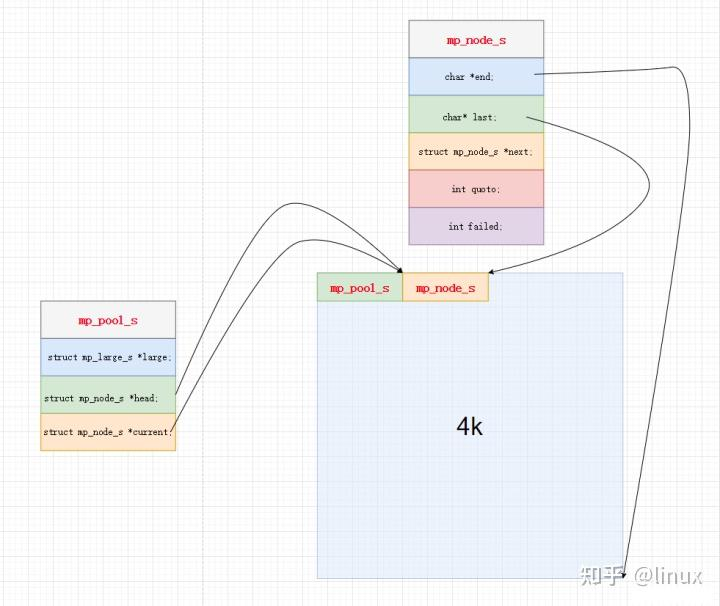

# 向外提供的api
- mp_create_pool：创建一个线程池，其核心是创建struct mp_pool_s这个结构体，并申请4k内存，将各个指针指向上文初始状态的图一样。
- mp_destroy_pool：销毁内存池，遍历小块结构体和大块结构体，进行free释放内存
- mp_malloc：提供给用户申请内存的api
- mp_calloc：通过mp_malloc申请内存后置零，相当于calloc
- mp_free：释放由mp_malloc返回的内存
- mp_reset_pool：将block的last置为初始状态，销毁所有大块内存
- monitor_mp_poll：监控内存池状态

# 内存对齐
访问速度是内存对齐的原因之一，另外一个原因是某些平台(arm)不支持未内存对齐的访问

在4k里面划分内存，那么必然有很多地方是不对齐的，所以这里提供两个内存对齐的函数。那么为什么要内存对齐呢？其一：提高访问速度；其二：某些平台arm不支持未对其的内存访问，会出错。

初始状态

