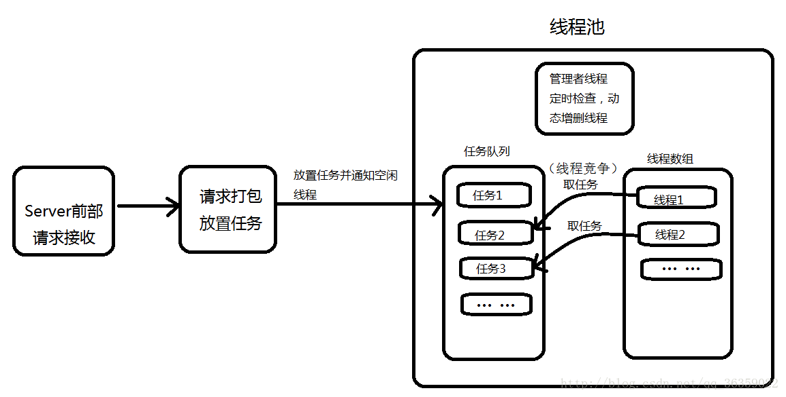
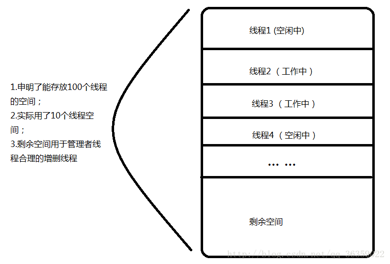

# 线程池描述
    池式结构：在计算机体系结构中有许多池式结构：内存池、数据库连接池、请求池、消息队列、对象池等等。
    池式结构解决的主要问题为缓冲问题，起到的是缓冲区的作用。

## 为什么要用线程池？
通过使用线程池，我们可以有效降低多线程操作中任务申请和释放产生的性能消耗。特别是当我们每个线程的任务处理比较快时，系统大部分性能消耗都花在了pthread_create以及释放线程的过程中。那既然是这样的话，何不在程序开始运行阶段提前创建好一堆线程，等我们需要用的时候只要去这一堆线程中领一个线程，用完了再放回去，等程序运行结束时统一释放这一堆线程呢？按照这个想法，线程池出现了。

## 线程池的原理 
如果并发的线程数较多，每个线程执行一段时间就结束，频繁创建线程就会大大降低系统的效率。

线程池允许一个线程多次复用，且每次复用的线程内部的消息处理可以不相同。是一种多线程处理形式，处理过程中将任务添加到队列，然后再创建线程后自动启动这些任务。线程池都是后台线程。每个线程都使用默认的堆栈大小，以默认的优先级运行，并处于多线程单元中。如果某个线程在托管代码中空闲（如正在等待某个事件），则线程池将插入另一个辅助线程来使所有处理器保持繁忙。如果所有线程池线程都始终保持繁忙，但队列中包含挂起的工作，则线程池将在一段时间后创建另一个辅助线程，但线程的数目永远不会超过最大值。超过最大值的线程可以排队，但他们要等到其他线程活动完成后才启动。

## 线程池的功能有哪些？
- 解决任务处理
- 阻塞IO
- 解决任务处理过程中频繁创建与销毁线程的性能成本问题
- 便于管理任务线程

---
## 线程池的应用场景
高并发服务器的
- 日志存储
- 消息收发

##  实现原理
组成分为3个部分，这三个部分配合工作就可以得到一个完整的线程池：

1. 任务队列， 存储需要处理的任务，由工作的线程来处理这些任务
   - 通过线程池提供的API函数，将一个待处理的任务添加到任务队列，任务就是待执行的回调函数
   - 已处理的任务会被从任务队列中删除
   - 线程池的使用者，也就是调用线程池函数往任务队列中添加任务的线程就是生产者线程。
2. 工作的线程（任务队列中任务的消费者，工作队列） N个
    - 线程池中维护了一定数量的工作线程，他们的作用是不停的读任务队列，从里面取出任务并处理
    - 工作的线程相当于是任务队列的消费者角色。
    - 如果任务队列为空，工作的线程将会被阻塞（使用条件变量/信号量阻塞）
    - 如果阻塞之后有了新的任务，由生产者将阻塞解除，工作线程开始工作
3. 管理者线程（不处理任务队列中的任务），1个
    - 他的任务是周期性的对任务队列中的任务数量以及处于忙状态的工作线程个数进行检测
    - 当任务过多的时候，可以适当地创建一些新的工作线程
    - 当任务过少的时候，可以适当地销毁一些工作的线程

---

## 线程数组
线程数组实际上是在线程池初始化时开辟的一段存放一堆线程tid的空间，在逻辑上形成一个池，里面放置着提前创建的线程；这段空间中包含了正在工作的线程，等待工作的线程(空闲线程)，等待被销毁的线程，申明但没有初始化的线程空间。
